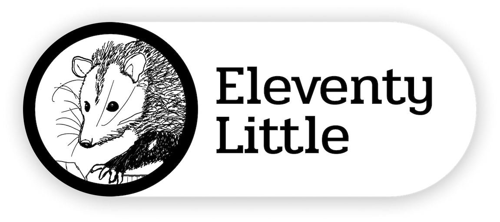

<p align="center">

</p>

# eleventy-little

Little presentations with a big impact. Powered by Eleventy.

## Features

- Makes text and images on slides as large as possible
- Syntax highlighting for code snippets
- Creates two version of slides: presentation mode and print mode
- Comments included in the markdown are provided in the console for presenting on a separate screen
- Support for additional theme files to override slide styles

### Shortcodes:

- use a web service to take a screenshot for a website and cache it

``

- download a font from Google Font for local import

``

Use it as a header with the `headerFont` property in presentation frontmatter.

## Use

Put markdown files with each slide separated by `---` in the `/src/presentations` directory.

Frontmatter can be provided, for example:

```
---

title: 'Eleven Reasons to Love Eleventy'
theme: 'eleven'
headerFont: 'Roboto Slab'

---
```

Use `yarn start` to build and run a dev server for your presentations.

## Inspiration

This project has borrowed significantly from

- [big](https://github.com/tmcw/big)
- [biggie](https://github.com/tmcw/biggie)
- [eleventy-presentation](https://github.com/cfjedimaster/eleventy-presentation)

It's more complicated than most of these but I think it benefits from the Eleventy ecosystem to make it easier

## Improvements

- Pre-process slides to compute font sizes at build-time
- Improve listing of presentations

