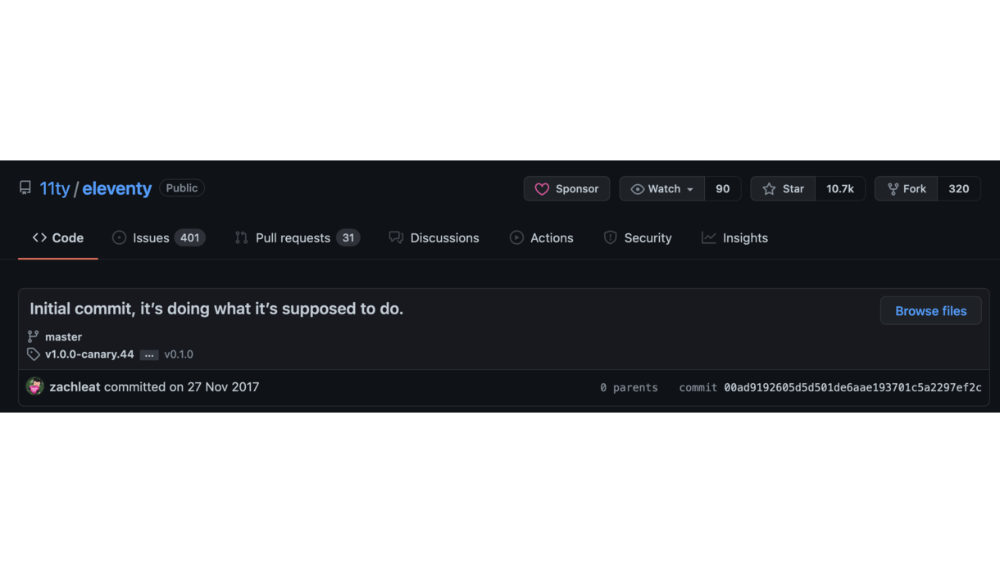

<!--
  I'm Christian and today I'm going to be introducing a static site generator written in JavaScript called Eleventy. I work with Joe at Cambridge Intelligence out of Canada and it's great to be here with you all today.
-->

---


<!--
  I'm going to start things today with a bit of a story. Being back in the UK for a bit reminded me of something that happened nearly 20 years ago now.

  I was staying up late one night on MSN Messenger chatting with friends – as I did back in those days and I had taken to exploring one of those educational content management portals – you probably know the one I'm talking about.

  That's when I stumbled upon the folder named something like "LIVE WEBSITE"
-->

---


---


<!-- In some ways you could think of Dreamweaver as a static site generator. -->

---

## Static Site Generators

<!-- Wider space is known as Jamstack.

Originally JS, APIs and Markup, now broadly referring to architectural approach to building websites
decoupled, static-first, progressively enhanced -->

<!-- People often gravitate towards SSGs that match the library or framework they're most comfortable with.

Gatsby - React, Jekyll - Ruby, Hugo - Go, Hexo - JS
-->

---


---

## Introducing Eleventy

---



<!-- A little different. -->

---



---

## Built with JavaScript

---

### ... but _not_ a JavaScript framework

<!-- It does not recommend nor force your HTML to include any Eleventy-specific client-side JavaScript. This is a core facet of the project’s intent and goals.

"We are not a JavaScript framework" -->

---

## Betting on JavaScript

<!-- npm ecosystem, incredible range of implementations -->

---

## Simple & Flexible

---

## Only outputs what you ask

<!-- Static files can offer amazing performance. To maintain that performance edge, Eleventy allows you to have full control over what and how JavaScript is included in your content. -->

---

## Unopinionated

<!-- Simplicity means that it leaves the opinions... Another way to put it is -->

---

## Eleventy doesn't care...

<!-- The amount it doesn't care is remarkable -->

---

## Eleventy doesn't care...

what you're building

<!-- Blog posts, notes, books, emails, PDFs, SVGs, OpenGraph, etc.

Even slides! like these!
-->

---

## Eleventy doesn't care...

what other tools you're using

<!-- Tailwind, Gulp, SCSS, etc. -->

---



---

## Fast!

<!-- Build times but also the sites you make.  -->

---


---



---

## Eleventy doesn't care...

about your folder structure

---

## Eleventy doesn't care...

where your data is from

<!-- API, headless CMS?  -->

---



<!-- recently section -->

---

```js
const Cache = require('@11ty/eleventy-cache-assets');

module.exports = {
  async newsletter() {
    try {
      const items = await Cache('https://sourcetarget.email/feed.json', {
        duration: '1w',
        type: 'json',
      });
      return items.map((edition) => {
        return {
          date,
          url: edition.url,
          title: `source/target ${edition.title}`,
          isNewsletter: true,
        };
      });
    } catch (ex) {
      console.log(ex);
      return [];
    }
  },
};
```

---

```js
eleventyConfig.addCollection('recently', async (collection) => {
  const allContent = collection.getFilteredByGlob(`./src/content/**/*.md`);
  const newsletterEditions = await newsletter();

  return [...allContent, ...newsletterEditions]
    .filter(recentLivePosts)
    .sort(sortDates)
    .slice(0, 6);
});
```

---

## Eleventy doesn't care...

which template language you use

<!-- meta programming -->

---



---

```liquid
<!DOCTYPE html>
<html lang="en">
  <head>
    

    <link rel="alternate" type="application/rss+xml" title="{{ site.title }}" href="{{ site.url }}/feed.xml"/>

    <link rel="stylesheet" href="{{ '/css/fonts.css' | url }}">
    <link rel="stylesheet" href="{{ '/css/style.css' | url }}">

  </head>
  <body>
    
    
    {{ content | latex | safe }}
    <footer>
      <div>
        <p>⁂&emsp;{{ meta.authorName }} <a href="/meta" class="meta">meta</a> </p>
      </div>
    </footer>
  </body>
</html>

```

---

## Universal Shortcodes

<!-- These span across templates, frictionless, mix and match -->

---

```liquid
  
```

---



---

## Plugins

---



---

## Image

<!-- Think back to my image problem at the start

Picture elements, fancy new formats -->

---

## Inclusive Language

---



---

## Accessibility-first

---

> "It’s very important that we take responsibility for the code we publish and deliver and strive to correct accessibility issues with the same _veracity_ as a full service outage."

<small>https://www.11ty.dev/docs/accessibility/</small>

---

## Syntax Highlighting

<!-- All the code examples are using the syntax highlighting plugin.

No page bloat, no JS on the client side -->

---

## Why no JS?

<!-- Better caching, purposeful website building, 20 years later I feel like I'm getting a better understanding of HTML, JS and CSS than I ever did -->

---

## Hand-crafted but not by hand

---

> But now: this website is my own little corner of the internet, where I know how everything works, and I know all of its little idiosyncrasies.

> Everything that I love about it is my fault.

> Everything that I hate about it is my fault.

<!-- > And I’m the only person on the planet who cares enough to tidy things up, to make it better, to shape it, evolve it, or…if it all becomes too much, I can burn it to the ground. -->

<small>Brian Lovin - The shape of software</small>

---

<h1 class="nowrap">Thank you!</h1>

---

⁂ cjlm.ca

⁂ @cjlmiles

⁂ sourcetarget.email
